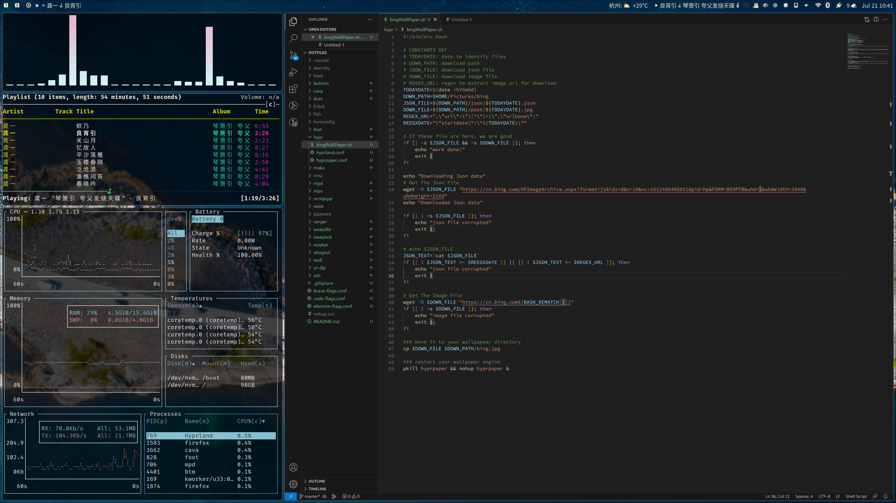

# My Dotfiles
> this is a dotfile repo

# Components


- **WM**                : [Hyprland](https://github.com/hyprwm/Hyprland) :art: WM for Wayland!
- **Shell**             : [zsh](https://wiki.archlinux.org/index.php/zsh) :shell: with [oh my zsh](https://github.com/ohmyzsh/ohmyzsh)!
- **Terminal**          : [foot](https://codeberg.org/dnkl/foot) :foot:
- **Panel**             : [waybar](https://github.com/Alexays/Waybar) :shaved_ice: using [nerd fonts](https://github.com/ryanoasis/nerd-fonts)!
- **Notify Daemon**     : [mako](https://github.com/emersion/mako) 🔔 
- **App Launcher**      : [wofi](https://hg.sr.ht/~scoopta/wofi) :rocket:
- **Wallpaper Manager** : [hyprpaper](https://github.com/hyprwm/hyprpaper) 🖼️

and some other stuff.

# How to use
```
# eg: setup waybar config
> ln -s `pwd`/waybar ~/.config/waybar

# eg: setup electron apps config
> ln -s `pwd`/code-flags.conf  ~/.config/code-flags.conf
```

# Download some fonts
> AUR ([Nerd Fonts Group](https://archlinux.org/groups/any/nerd-fonts/))